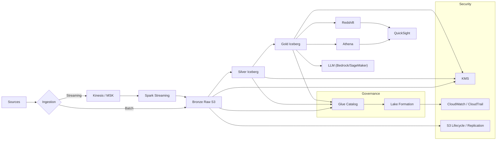
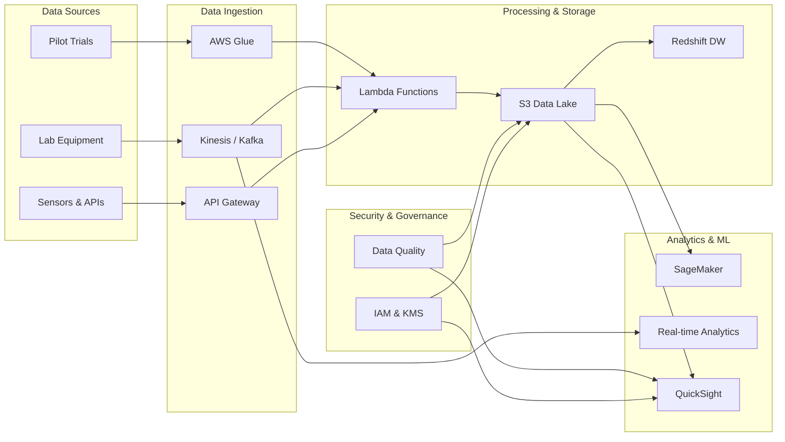

# Building a Scalable Data Pipeline for Nestlé Product Development

How we can build a data pipeline for Nestlé's Product Technology Centre? 
They have this nutrition lab that creates tons of data every day - like test results from lab equipment, data from pilot plant trials, sensory evaluation results, and reports from external analysis companies.

The main goal is to take all this messy data and turn it into something useful - real-time dashboards that show current quality metrics and historical reports that help improve products over time.

## What We Are Trying to Solve

Imagine you are working in a big nutrition lab. Every day you have:

- Lab machines spitting out thousands of test results
- Pilot plant equipment recording temperature, pressure, mixing times
- Taste testers filling out forms about how products taste
- External labs sending you PDF reports via email

Right now, all this data sits in different places and nobody can get a clear picture of what is happening. We want to build a system that automatically collects all this data, cleans it up, and presents it in dashboards that managers can actually use.

## High-Level Architecture

Simplified Version:

## Step by Step Approach

### Step 1: Getting Data Into the System (Data Ingestion)

The first challenge is collecting data from all these different sources. Think of this like setting up multiple mailboxes for different types of mail.

**For Real-Time Data** (like sensor readings):
We use something called Kinesis or Kafka. These are like super reliable message delivery services. When a lab machine measures protein content every 30 seconds, it sends that measurement to Kinesis, which makes sure the data never gets lost even if something breaks down.

Why do we choose Kinesis? Well, it is managed by Amazon, so we do not have to worry about maintaining servers. It automatically scales up when we get more data and scales down when we get less. It is like having a post office that automatically hires more workers during Christmas season.

**For Batch Data** (like daily reports):
Some data does not come in real-time. Maybe external labs send us reports once per day, or we get weekly summaries. For this, we just upload files directly to S3 storage. S3 is like a massive digital warehouse where we can store unlimited amounts of data very cheaply.

**Alternative Approach with Open Source Tools:**
Instead of using AWS Kinesis, we could set up our own Kafka cluster. Kafka is open source and gives us more control, but we would need to maintain the servers ourselves. For a big company like Nestlé, the managed service is probably better because it is less work for the IT team.

### Step 2: Processing and Cleaning the Data

Raw data from lab equipment is usually messy. You might have duplicate readings, invalid values (like negative protein content), or missing timestamps. We need to clean this up before anyone can use it.

**AWS Approach:**
We use AWS Glue, which runs Apache Spark jobs to process large amounts of data. Spark is like having a team of workers who can process different parts of your data simultaneously. We write Python scripts that tell Spark how to clean the data.

For example, our Python script might say:

- Remove any protein measurements below zero (impossible values)
- Convert all temperature readings to Celsius
- Fill in missing timestamps based on the previous reading
- Calculate quality scores based on multiple measurements

**Open Source Alternative with DataHub and Metaflow:**

Here is where it gets interesting! Instead of using AWS Glue, we could potentially use:

**DataHub by LinkedIn** for the metadata management and data catalog part. DataHub is amazing for tracking where data comes from, how it gets transformed, and who is using it. It would replace the "Governance" part of our diagram. DataHub can show us the complete lineage of our data - like "this protein measurement started from Lab Machine A, got processed by Script B, and is now being used in Dashboard C."

**Metaflow by Netflix** could replace some of the processing workflows. Metaflow is designed for data science workflows and makes it easy to build, deploy, and monitor data processing pipelines. It would be great for the machine learning parts where we want to predict quality scores or detect anomalies.

**Is this possible?** We could have:

- DataHub managing our data catalog and governance
- Metaflow orchestrating our data processing workflows
- Still use S3 for storage (because it is just too good and cheap)
- Still use Kafka for streaming (because it works great with both DataHub and Metaflow)

The main trade-off is that we would need more expertise to set up and maintain these open source tools, but we would have more flexibility and potentially lower costs.

### Step 3: Storing Data in Layers

We use what is called a "medallion architecture" - think of it like organizing your closet into different sections:

**Bronze Layer (Raw Data):**
This is where we store data exactly as we received it. Like keeping all your clothes in a laundry basket - messy but everything is there. We keep this data forever because sometimes we need to go back and reprocess it with better logic.

**Silver Layer (Clean Data):**
This is where we store data after basic cleaning. Like organizing your clothes by type - shirts with shirts, pants with pants. We have removed invalid values and standardized formats.

**Gold Layer (Business Ready Data):**
This is where we store data that is ready for business users. Like having outfits pre-planned and organized by occasion. This data is aggregated, has quality scores calculated, and is optimized for dashboards.

We use Apache Iceberg tables for Silver and Gold layers. Iceberg is cool because it gives us database-like features (like being able to update records) while still storing data in cheap S3 storage.

### Step 4: Making Data Available for Analysis

Once we have clean, organized data, people need to be able to access it:

**For Data Scientists and Analysts:**
We use Amazon Athena, which lets people write SQL queries directly against data in S3. It is like being able to ask questions about your data using normal database language, but without having to set up an expensive database.

**For Executive Dashboards:**
We use Amazon Redshift for fast dashboard queries and QuickSight for the actual dashboards. Redshift is optimized for complex analytical queries, and QuickSight makes pretty charts and graphs that executives can understand.

**For Advanced Analytics:**
We can connect machine learning tools like SageMaker to predict quality issues before they happen or identify patterns that humans might miss.

### Step 5: Data Quality and Monitoring

This is super important! We need to make sure our data is always fresh and accurate.

**Data Quality Checks:**
We use tools like Great Expectations (a Python library) to set rules like:

- Protein content must be between 0 and 100 percent
- Every sample must have a unique ID
- Timestamps cannot be in the future
- pH levels must be between 0 and 14

**Monitoring with Traditional and Modern Tools:**

**AWS CloudWatch:** This monitors all our AWS services and sends alerts if something breaks. Like having a security system for your house that calls you if a window breaks.

**Splunk for Security:** We could use Splunk to monitor security aspects of our pipeline. Splunk is excellent at analyzing log files and detecting suspicious activities. For example, it could alert us if someone is trying to access sensitive recipe data they should not have access to, or if there are unusual data access patterns that might indicate a security breach.

**Data Freshness Monitoring:** We set up alerts that tell us if data is more than 30 minutes old. For a nutrition lab, stale data could mean missing a quality issue that affects product safety.

**Alternative Monitoring Approach:**
Instead of using only AWS tools, we could use open source monitoring stack:

- Prometheus for collecting metrics
- Grafana for visualization
- AlertManager for sending notifications
- Plus Splunk for security monitoring

This gives us more control and potentially better integration with other systems Nestlé might be using.

### Step 6: Security and Governance

Security is crucial because we are dealing with:

- Proprietary recipes and formulations
- Customer data from taste tests
- Regulatory compliance data

**Basic Security Measures:**

- All data is encrypted when stored and when moving between systems
- Access controls so only authorized people can see sensitive data
- Audit logs that track who accessed what data when
- Regular security scans and updates

**Advanced Security with Splunk:**
Splunk can provide enhanced security monitoring by:

- Analyzing access patterns to detect insider threats
- Monitoring for data exfiltration attempts
- Correlating security events across all systems
- Providing detailed forensic analysis if something goes wrong

**Data Governance:**
We use AWS Lake Formation to control who can access what data. It is like having different keys for different rooms in a building. Lab technicians might see raw test data, but only executives see profitability analysis.

### Step 7: Machine Learning and Advanced Analytics

Once we have clean, reliable data flowing, we can add some intelligent features:

**Anomaly Detection:**
Using simple statistical methods or machine learning to automatically flag unusual readings. Like if vitamin D levels suddenly spike, the system could alert quality managers immediately.

**Predictive Analytics:**
Using historical data to predict future quality issues. For example, if we notice that certain temperature patterns in the pilot plant lead to texture problems, we can warn operators before it happens.

**Smart Search and Q\&A:**
Using large language models (LLM) like AWS Bedrock to let people ask questions in plain English. A manager could ask "Why was protein content low last Tuesday?" and get an answer that references the actual data and known issues.

## Why This Architecture Works Well

**For the Business:**

- Real-time visibility into quality metrics
- Faster problem detection and resolution
- Better decision making with historical trends
- Reduced waste from catching issues early

**For IT Teams:**

- Most components are managed services (less maintenance)
- Scales automatically as data grows
- Good cost control with pay-per-use pricing
- Integration with existing AWS services

**For Data Scientists:**

- Easy access to clean, well-organized data
- Familiar tools (Python, SQL, Jupyter notebooks)
- Good environment for experimentation
- Production-ready model deployment

## Common Challenges and Solutions

**Challenge 1: Data Quality Issues**
Solution: Implement quality checks at every layer and maintain data lineage so we can trace problems back to their source.

**Challenge 2: Different Teams Need Different Views**
Solution: Use the medallion architecture so raw data, clean data, and business-ready data are clearly separated.

**Challenge 3: Scaling Costs**
Solution: Use lifecycle policies to automatically move old data to cheaper storage, and optimize query patterns to reduce processing costs.

**Challenge 4: Security and Compliance**
Solution: Implement encryption everywhere, detailed access controls, and comprehensive audit logging. Consider Splunk for advanced security monitoring.

## Daily Operations

**What This Looks Like Day-to-Day:**

- Morning: Check dashboards for any overnight quality alerts
- Throughout the day: Monitor data freshness and pipeline health
- Weekly: Review data quality scores and investigate any trends
- Monthly: Analyze costs and optimize where possible

The goal is to build something that mostly runs itself but gives clear signals when human attention is needed.

This approach gives Nestlé a modern, scalable data infrastructure that can grow with their needs while maintaining the reliability and security required for a global food company. The combination of managed AWS services with strategic use of open source tools like DataHub and Metaflow provides the best balance of functionality, cost, and maintainability.

