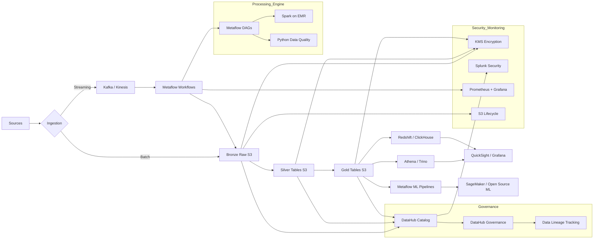

# Final Architecture with DataHub and Metaflow

Approach with DataHub and Metaflow:

## Final Architecture Diagram

## Benefits of This Approach

### **Why DataHub Over AWS Glue Catalog:**

**Better Metadata Management:**

- DataHub provides a much richer user interface for exploring data
- Better search and discovery capabilities - users can actually find the data they need
- Rich documentation and collaboration features
- Better integration with popular tools like Airflow, Spark, and Python environments

**Superior Data Lineage:**

- DataHub shows complete data lineage across all systems, not just AWS
- Visual representation of how data flows from source to dashboard
- Impact analysis - see what breaks if you change a particular dataset
- Better debugging when data issues occur

**Community and Extensibility:**

- Active open source community with frequent updates
- Can customize and extend functionality as needed
- Better integration with non-AWS tools
- No vendor lock-in

### **Why Metaflow Over AWS Glue:**

**Better for Data Science Workflows:**

- Metaflow was specifically designed for data science and ML pipelines
- Better experiment tracking and reproducibility
- Easier to version and rollback workflows
- Great integration with Python data science stack

**More Flexible Processing:**

- Can run workflows on AWS, on-premise, or hybrid environments
- Better resource management and cost optimization
- Easier to debug and monitor individual workflow steps
- Superior handling of complex dependencies between tasks

**Developer Experience:**

- Much easier for Python developers to learn and use
- Better local development and testing capabilities
- Cleaner code organization and reusability
- Built-in experiment tracking and model versioning

### **Cost Benefits:**

- Lower licensing costs (open source vs proprietary)
- More efficient resource utilization
- Better cost visibility and control
- Can run on cheaper compute when appropriate

### **Flexibility Benefits:**

- Not locked into AWS ecosystem
- Can integrate with existing company tools
- Easier to customize for specific business needs
- Future-proof against changing requirements

## Complete Glossary and Abbreviations

### **Data Architecture Terms:**

**API (Application Programming Interface):**
A way for different software systems to talk to each other. Like a waiter who takes your order and brings it to the kitchen.

**Batch Processing:**
Processing data in large chunks at scheduled times, like doing laundry once per week instead of washing each item immediately.

**Bronze/Silver/Gold Layers:**

- **Bronze:** Raw data as received (messy but complete)
- **Silver:** Clean and validated data (organized and reliable)
- **Gold:** Business-ready data (aggregated and optimized for analysis)

**Data Lake:**
A storage system that can hold any type of data in its original format. Like a massive digital warehouse where you can dump everything and organize it later.

**Data Lineage:**
The complete journey of data from source to final use. Like a family tree but for data, showing where it came from and where it goes.

**Data Pipeline:**
An automated system that moves and transforms data from sources to destinations. Like a factory assembly line for data.

**Data Warehouse:**
A database optimized for analysis and reporting. Like a library where books are organized perfectly for research.

**ETL (Extract, Transform, Load):**
The process of getting data from sources, cleaning it up, and putting it somewhere useful.

**Lakehouse:**
A modern architecture that combines the flexibility of data lakes with the performance of data warehouses.

**Medallion Architecture:**
A way of organizing data in layers (Bronze, Silver, Gold) that get progressively cleaner and more useful.

**Streaming:**
Processing data immediately as it arrives, like washing dishes right after you use them instead of letting them pile up.

### **AWS Services:**

**Amazon Athena:**
A service that lets you query data stored in S3 using SQL. Like being able to ask questions about files stored in a digital warehouse.

**Amazon Kinesis:**
A service for handling real-time streaming data. Like a conveyor belt that never stops moving.

**Amazon QuickSight:**
AWS's business intelligence tool for creating dashboards and reports.

**Amazon Redshift:**
AWS's data warehouse service, optimized for analytical queries.

**Amazon S3 (Simple Storage Service):**
AWS's object storage service. Think of it as unlimited digital storage space.

**AWS Glue:**
AWS's managed ETL service that can process large amounts of data using Apache Spark.

**AWS Lambda:**
A service that runs code without managing servers. Like hiring someone to do a specific task without worrying about where they work.

**CloudWatch:**
AWS's monitoring and logging service.

**IAM (Identity and Access Management):**
AWS's service for controlling who can access what resources.

**KMS (Key Management Service):**
AWS's encryption key management service.

### **Open Source Tools:**

**Apache Iceberg:**
A table format that brings database-like features to data lake storage.

**Apache Kafka:**
An open source streaming platform. Like a super reliable postal service for digital messages.

**Apache Spark:**
A framework for processing large amounts of data across multiple computers simultaneously.

**DataHub:**
LinkedIn's open source data catalog and metadata management platform.

**Great Expectations:**
A Python library for data quality testing and validation.

**Metaflow:**
Netflix's open source framework for building and managing data science workflows.

**Prometheus:**
An open source monitoring and alerting system.

**Grafana:**
An open source platform for monitoring and observability dashboards.

### **Database and Analytics Terms:**

**ACID (Atomicity, Consistency, Isolation, Durability):**
Properties that ensure database transactions are processed reliably.

**BI (Business Intelligence):**
Tools and processes for analyzing business data to make better decisions.

**CRUD (Create, Read, Update, Delete):**
The four basic operations you can do with data.

**SQL (Structured Query Language):**
The standard language for working with relational databases.

**NoSQL:**
Database systems that don't use traditional table structures.

### **Machine Learning Terms:**

**Anomaly Detection:**
Using algorithms to automatically identify unusual patterns in data.

**ML (Machine Learning):**
Computer systems that can learn and improve from data without being explicitly programmed.

**MLOps:**
Practices for deploying and maintaining machine learning systems in production.

**RAG (Retrieval Augmented Generation):**
A technique that combines large language models with specific databases to answer questions.

### **Security and Monitoring:**

**Encryption:**
Scrambling data so only authorized people can read it.

**Audit Trail:**
A record of who did what, when they did it, and what data they accessed.

**VPC (Virtual Private Cloud):**
A secure, isolated section of AWS cloud where you can run resources.

**Splunk:**
A platform for searching, monitoring, and analyzing machine-generated data.

### **Performance and Scalability:**

**Auto-scaling:**
Automatically adding or removing computing resources based on demand.

**Caching:**
Storing frequently used data in fast memory so it can be accessed quickly.

**Load Balancing:**
Distributing work across multiple servers to improve performance.

**Partitioning:**
Dividing large datasets into smaller, more manageable pieces.

### **Common Abbreviations:**

- **API:** Application Programming Interface
- **AWS:** Amazon Web Services
- **BI:** Business Intelligence
- **DAG:** Directed Acyclic Graph (workflow structure)
- **DQ:** Data Quality
- **ETL:** Extract, Transform, Load
- **IAM:** Identity and Access Management
- **JSON:** JavaScript Object Notation
- **KMS:** Key Management Service
- **ML:** Machine Learning
- **MSK:** Managed Streaming for Kafka
- **NPTC:** Nestlé Product Technology Centre
- **PII:** Personally Identifiable Information
- **RAG:** Retrieval Augmented Generation
- **REST:** Representational State Transfer
- **S3:** Simple Storage Service
- **SLA:** Service Level Agreement
- **SLO:** Service Level Objective
- **SQL:** Structured Query Language
- **TLS:** Transport Layer Security
- **VPC:** Virtual Private Cloud
